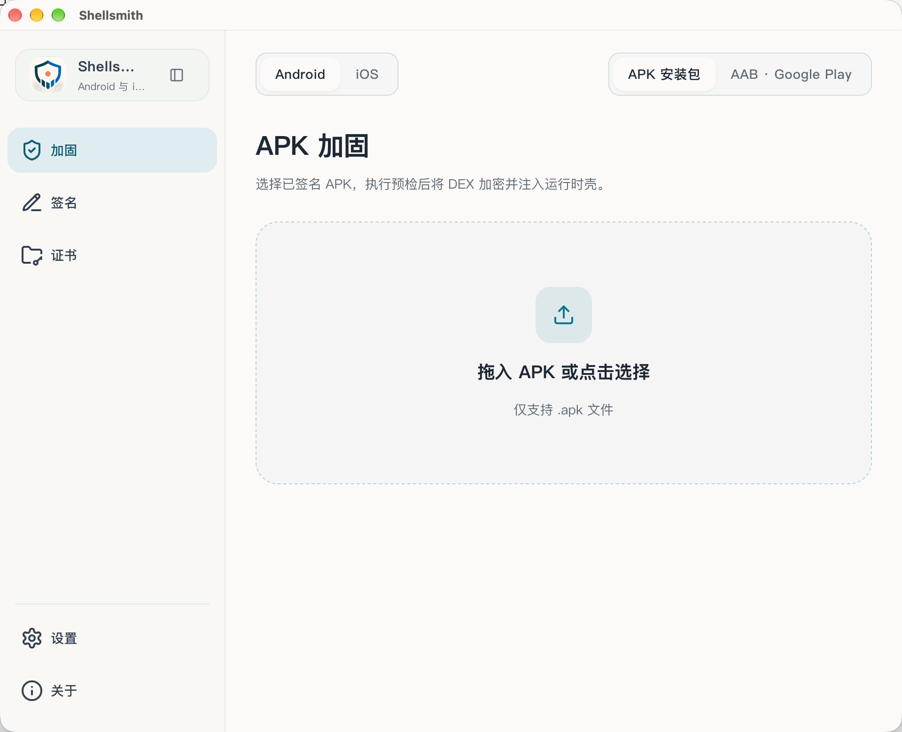

# Shellsmith — Android and iOS App Hardening

[简体中文](README.md) | English

[](https://github.com/kairowan/Shellsmith/releases/latest)
[](https://github.com/kairowan/Shellsmith/actions/workflows/ci.yml)
[](#license)

Protect Android APK/AAB outputs and iOS source projects locally. Android uses DEX, resource, and runtime protection. iOS combines selected Swift literal protection, freeRASP, and Apple's native signing chain. These controls raise analysis and tampering costs; they do not guarantee that an app cannot be unpacked or reverse engineered.

The recommended desktop GUI supports Windows, macOS, Linux, and Chinese/English interfaces. A source-built CLI is available for automation and development.

> Use only with applications you own or are authorized to protect. Do not bypass third-party protections or use this tool for unauthorized purposes.

## Core Capabilities

- **DEX and runtime protection:** encrypt application DEX files, bind them to the original certificate, and apply baseline anti-debugging or optional strict environment checks.
- **iOS source protection:** modify an isolated working copy with Swift Confidential 0.5.2 and freeRASP iOS 7.1.4, then archive, export, and verify it with `xcodebuild`.
- **Preflight checks:** inspect signatures, existing protection, system requirements, and ABIs, with compatibility warnings and supported actions.
- **Integrated signing:** import, create, and manage certificates; automatically sign protected output or sign an APK independently.
- **Reusable settings:** remember protection options and the protection page's certificate choice, customize output directory and filename, and freeze each running task's configuration.
- **Installation compatibility:** handle APK ZIP alignment and common native-library cases, with separate standard and Android 4.4 industrial modes.
- **Diagnostics:** copy sanitized summaries and optionally preview and submit an error report. APKs and signing materials are processed locally.

## Download and Quick Start

Download a stable desktop installer from [GitHub Releases](https://github.com/kairowan/Shellsmith/releases/latest).

| Platform | Package |
|---|---|
| Windows | `Shellsmith_x.y.z_windows_x64_setup.exe` |
| macOS | `Shellsmith_x.y.z_macos_universal.dmg` |
| Linux | `Shellsmith_x.y.z_linux_amd64.AppImage` or `.deb` |

Install a **full JDK 8 or later**, with `java` and `keytool` available; PVM2 requires Java 17+. Desktop release users do not need to install the Android SDK. Local macOS builds use ad-hoc signing. External releases must use the Developer ID/notarization mode and have `_notarized` in the artifact name; otherwise download and run them only from a trusted source.

Android quick start:

1. In **Certificates**, import the original APK's signing certificate. For a new project, you may create one, but the input APK must also be signed with it first.
2. In **Protect**, select an already signed APK, or switch to **AAB · Google Play** and select a signed AAB, then review the preflight results.
3. Choose the target system and protection policy. Normally use Android 5.0+ and the recommended standard protection; use industrial mode only when Android 4.4 is required.
4. Review the output directory, filename, automatic signing certificate, and per-app sharing choice, then start protection.
5. Test the signed output on target devices: installation, launch, core functionality, and upgrade installation.

iOS quick start: install full Xcode on macOS, open **Protect → iOS**, select an `.xcodeproj` or `.xcworkspace`, enter the scheme, Team ID, and Bundle ID, run the check, and choose a separate empty output directory. `confidential.yml`, the freeRASP watcher email, and the App Attest server endpoint are all optional. Strict client hardening works without an endpoint, but it does not include a server-side device-attestation loop. The source project is left unchanged.

Output defaults to the input APK's directory with a suggested filename; both can be changed before execution. Without automatic signing, sign the output with the original certificate. **Re-signing protected output with another certificate prevents startup.**

<details>
<summary>macOS reports that the developer cannot be verified</summary>

After verifying the download source and moving the application to `/Applications`, you can run:

```bash
xattr -rd com.apple.quarantine /Applications/Shellsmith.app
```

This removes quarantine; it does not mean the application is notarized by Apple. Open it again. See the [usage guide](docs/usage.md) for more help.

</details>

## CI/CD and Cross-Platform Releases

GitHub Actions live under `.github/workflows/`:

- Every push to `main` and every pull request runs Rust, Python, iOS-core, and frontend checks.
- After every successful CI run on `main`, the Release workflow automatically computes a `1.4.2-build.<CI run number>` version, builds native Linux, macOS, and Windows installers, and creates a GitHub Release. You can still run `Release` manually for a specified version.
- The release job uploads Linux `.AppImage`/`.deb`, macOS `.dmg`, Windows `.exe`, Android runtime resources, and SHA-256 checksum files, and includes an automatic summary of the triggering commit.
- macOS builds use ad-hoc signing by default. Set `MACOS_RELEASE_MODE=developer-id`, a Developer ID identity, and a notarytool profile to produce a distributable notarized package.

The same scripts can be used locally:

```bash
VERSION=1.4.2 ./scripts/release-linux.sh
VERSION=1.4.2 ./scripts/release-macos.sh 1.4.2 universal
```

On Windows, run `./scripts/release-windows.ps1 -Version 1.4.2` from an elevated PowerShell. All three builds include the stub, PVM2 packer, Android resources, and signing tools; install and verify each package on its target OS before publishing.

## Preview



The screenshot illustrates the layout; available options depend on the current version. More screens and instructions are in the [usage guide](docs/usage.md).

## Compatibility and Limitations

| Mode | Scope |
|---|---|
| Android 5.0 and later | API 21+; `armeabi-v7a`, `arm64-v8a`, `x86`, and `x86_64`. An APK does not need all four ABIs |
| Android 4.4 industrial | API 19+; inputs must have no native libraries or only `armeabi-v7a` libraries. Physical-device coverage is an Android 4.4.2 `armeabi-v7a`/NEON industrial device |
| iOS source project | iOS 13+ SwiftUI/UIKit application targets; archive, export, and signing require macOS with full Xcode |

- Compatibility mode does not lower the application's `minSdkVersion`; vendor systems and hardware still need testing.
- The Android GUI and CLI support APK/AAB. Google Play App Signing, dynamic features, Asset Packs, and dynamic delivery still require validation in the target app's internal test track. Protected APKs/AABs cannot be protected again.
- iOS requires source and legitimate signing access. Shellsmith does not inject into arbitrary IPAs, bypass signatures, or repackage third-party apps. Objective-C can use RASP; Swift Confidential only processes Swift source.
- The GUI processes one APK or AAB at a time; no batch queue is provided.
- Unneeded legacy ABIs can be excluded with per-task confirmation. Prefer filtering them in the original project; missing business libraries are not generated.
- 16 KB ZIP alignment does not establish ELF page-size compatibility for every third-party library or guarantee Google Play acceptance.
- Linux startup applies a WebKitGTK DMABUF compatibility setting for Fedora AppImage issue [#121](https://github.com/kairowan/Shellsmith/issues/121); the reporter's release environment still requires validation.

See the [usage guide](docs/usage.md) for detailed boundaries. Include the version, environment, and sanitized diagnostics when reporting problems.

## How It Works and Security Scope

Protection reads the original certificate, compresses and encrypts DEX files, injects the stub, then rebuilds, aligns, and optionally signs the APK. At runtime, the stub checks the environment, validates or decrypts the DEX cache, loads code, and starts the original application.

Production uses a decrypted DEX cache in the application's private directory. It is **not a fully in-memory DEX loader or method-code extraction scheme**. Root access, process control, or other elevated privileges may allow runtime code extraction. Standard protection does not block startup solely because of root signals; strict protection blocks some risky environments but cannot guarantee detection of hidden root or prevent bypasses.

Hardening does not replace server-side authorization, key management, or application security design. See [runtime security](docs/design/runtime-security.md) and [technical internals](docs/design/internals.md).

The iOS pipeline edits only a working copy, resolves exact upstream Swift Package versions, generates a stable threat-event wrapper, uses Apple's native Archive/Export flow, and verifies signatures, Team ID, Bundle ID, entitlements, arm64, privacy manifests, dSYMs, and selected sensitive literals. Closed-source freeRASP behavior and the known RootHide gap remain upstream residual risks; see [iOS hardening](docs/design/ios-hardening.md).

## Privacy

APKs, certificates, keystores, and signing passwords are processed locally and not uploaded. The desktop tool has the following independent data channels:

The iOS balanced and strict profiles integrate freeRASP directly into the target app. Its `watcherMail`, security events, and network behavior are governed by Talsec's terms and privacy policy and require app-owner disclosure before release. Shellsmith does not host the freeRASP binary.

| Channel | Data and controls |
|---|---|
| Safe error reports | Preview and confirm each report; no raw logs, APKs, paths, package names, certificates, or passwords. Independent of the other channels |
| Per-app usage sharing | Controlled on protection/signing pages, selected by default for new package names. Opt-outs persist across pages and restarts. Successful operations send app name, package name, version code, tool version, operation, flow, success date, and protocol/deduplication metadata; no device identifier |

App sharing is maintainer-only and retained for 180 days. Opting out stops future sharing for that package but does not delete received records. **These reporting features are not injected into protected APKs.** See [data and privacy documentation](docs/ops/telemetry.md) for scope, retention, and deletion details.

In-app problem feedback never reports automatically: the feedback text (for bug reports, together with the automatically attached version, OS, Java, and tool-status diagnostics) is sent to a public GitHub issue only after the user fills in the form, previews it, and confirms sending; if the service is unavailable, the app offers to open a prefilled issue page in the browser instead.

## Documentation and Development

| Topic | Documentation |
|---|---|
| GUI, certificates, configuration locations, and CLI | [Usage guide](docs/usage.md) |
| Installation and runtime problems | [Troubleshooting](docs/ops/troubleshooting.md) |
| Source builds | [Build guide](docs/ops/build.md), [environment requirements](docs/ops/environment.md) |
| Architecture and internals | [Documentation index](docs/README.md) |
| iOS integration, configuration, and security scope | [iOS hardening](docs/design/ios-hardening.md) |
| Future work | [Roadmap](docs/process/roadmap.md) |

Detailed guides are currently primarily in Chinese. The CLI is source-built; Releases contain desktop GUI packages only. Build `make build-stub` first, then `make build-cli` or `make build-gui`. Refer to the build guide for dependencies and platform-specific steps.

## Feedback and Community

- Read the [support guide](docs/process/support.md), then open a [GitHub issue](https://github.com/kairowan/Shellsmith/issues); you can also submit directly from the **Problem feedback** section on the Settings page, where diagnostics are attached automatically for bug reports and can be previewed before sending.
- Use the [feature request form](https://github.com/kairowan/Shellsmith/issues/new?template=feature_request.yml), or upvote an existing matching request.
- Report vulnerabilities privately following [SECURITY.md](SECURITY.md). Do not publish exploits, business APKs, certificates, or passwords.

## Acknowledgements

Shellsmith builds on a large amount of open-source work. Listed below are the main projects that shape the tool's capabilities, ship inside release artifacts, or form the build chain. These tools are invoked locally for hardening and signing; their sources are not modified. Exact versions and the full transitive dependency list can be reproduced from `Cargo.lock`, `apps/shield-gui/package-lock.json`, and `shield-stub/gradle/libs.versions.toml`.

### Desktop framework and interface

| Project | License | Use |
|---|---|---|
| [Tauri](https://tauri.app/) · [tauri-plugin-updater](https://github.com/tauri-apps/plugins-workspace) · [tauri-plugin-dialog](https://github.com/tauri-apps/plugins-workspace) | Apache-2.0 OR MIT | Desktop framework, in-app updates with signature verification, file pickers |
| [React](https://react.dev/) · [Vite](https://vitejs.dev/) · [Tailwind CSS](https://tailwindcss.com/) | MIT | View layer and frontend build |
| [TypeScript](https://www.typescriptlang.org/) | Apache-2.0 | Frontend type system |
| [shadcn/ui](https://ui.shadcn.com/) · [Radix UI](https://www.radix-ui.com/) | MIT | Components and accessible interaction |
| [Lucide](https://lucide.dev/) · [Sonner](https://sonner.emilkowal.ski/) | ISC / MIT | Icons and toasts |
| [react-markdown](https://github.com/remarkjs/react-markdown) · [remark-gfm](https://github.com/remarkjs/remark-gfm) | MIT | Safe rendering of release notes |

### Rust libraries

| Project | License | Use |
|---|---|---|
| [RustCrypto](https://github.com/RustCrypto): `chacha20poly1305`, `hkdf`, `sha2`, `sha1` | Apache-2.0 OR MIT | DEX encryption, key derivation, certificate fingerprints |
| [zstd](https://github.com/gyscos/zstd-rs) | MIT | Compressing hardened artifacts |
| [zip](https://github.com/zip-rs/zip2) | MIT | Packing and parsing APK, AAB, and IPA files |
| [serde](https://serde.rs/) · [clap](https://github.com/clap-rs/clap) · [semver](https://github.com/dtolnay/semver) · [toml](https://github.com/toml-rs/toml) · [uuid](https://github.com/uuid-rs/uuid) | MIT OR Apache-2.0 | Serialization, CLI, version comparison, task identifiers |
| [tokio](https://tokio.rs/) · [reqwest](https://github.com/seanmonstar/reqwest) | MIT / MIT OR Apache-2.0 | Async runtime and upstream SDK downloads |
| [rusqlite](https://github.com/rusqlite/rusqlite) | MIT | Local certificate database |
| [anyhow](https://github.com/dtolnay/anyhow) · [thiserror](https://github.com/dtolnay/thiserror) · [log](https://github.com/rust-lang/log) · [tempfile](https://github.com/Stebalien/tempfile) · [directories](https://github.com/dirs-dev/directories-rs) · [dunce](https://gitlab.com/kornelski/dunce) · [which](https://github.com/harryfei/which-rs) · [walkdir](https://github.com/BurntSushi/walkdir) · [rand](https://github.com/rust-random/rand) | MIT OR Apache-2.0 and others | Errors, logging, paths, file handling |
| [colored](https://github.com/colored-rs/colored) | MPL-2.0 | Colored CLI output |
| [jni](https://github.com/jni-rs/jni-rs) · [cc](https://github.com/rust-lang/cc-rs) | MIT OR Apache-2.0 | JNI bindings and native compilation for the Android stub |

### Hardening, signing, and runtime components

| Project | License | Use |
|---|---|---|
| [Apktool](https://apktool.org/) 3.0.1 | Apache-2.0 | APK decoding and rebuilding; redistributed with releases |
| [apksigner](https://developer.android.com/tools/apksigner) (Android SDK Build-Tools) | Apache-2.0 | APK signing and signature verification; redistributed with releases |
| [bundletool](https://github.com/google/bundletool) · [aapt2](https://developer.android.com/tools) | Apache-2.0 | AAB module handling and resource compilation |
| [XopProtector](https://github.com/xopJack/XopProtector) | Apache-2.0 | PVM2 and True-VMP code protection; license and notices in `tools/licenses/` |
| [freeRASP](https://github.com/talsec/Free-RASP-iOS) 7.1.4 | MIT, subject to Talsec's fair usage policy | iOS runtime threat detection; resolved on the user's machine, no binary redistribution |
| [Swift Confidential](https://github.com/securevale/swift-confidential) 0.5.2 | Apache-2.0 | Swift sensitive literal protection (optional) |

The build chain additionally uses [Tauri CLI](https://github.com/tauri-apps/tauri), [cargo-ndk](https://github.com/bbqsrc/cargo-ndk), [Android Gradle Plugin](https://developer.android.com/build), [Android NDK](https://developer.android.com/ndk), [JUnit 4](https://junit.org/junit4/), [AndroidX Test](https://developer.android.com/training/testing), [ESLint](https://eslint.org/), [PostCSS](https://postcss.org/), and [Autoprefixer](https://github.com/postcss/autoprefixer).

If a credit is wrong, a license is mislabeled, or a project is missing, please open an issue or pull request and we will correct it.

## License

Dual-licensed under **MIT OR Apache-2.0**, at your choice: [MIT](LICENSE-MIT) · [Apache-2.0](LICENSE-APACHE).
